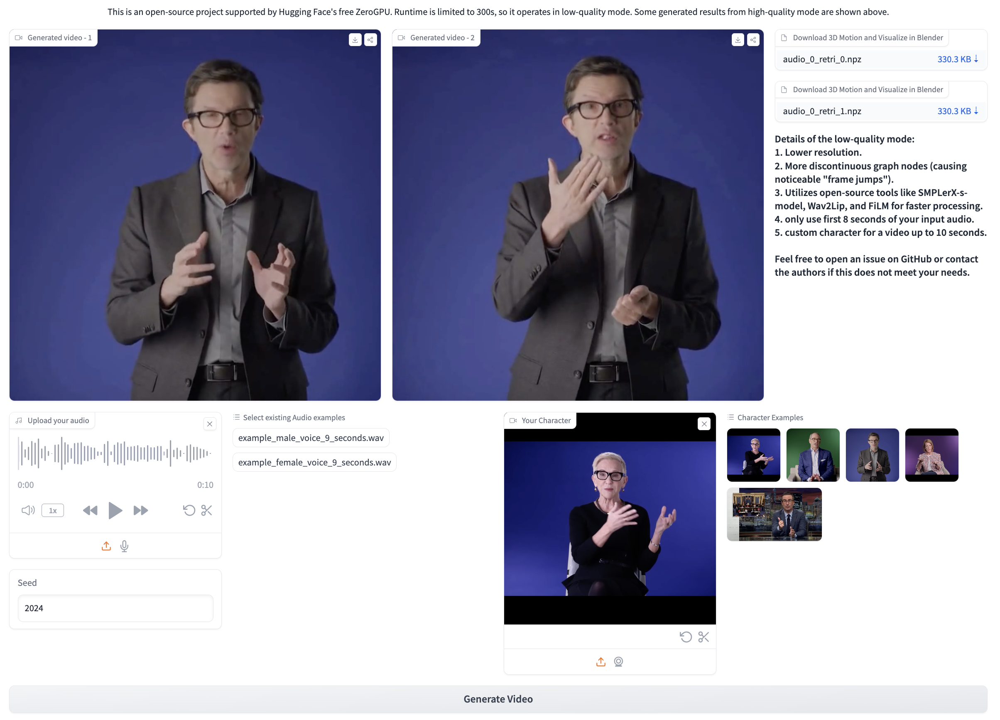

<div align="center">
<!-- <p align="center">  </p> -->
<h2>TANGO: Co-Speech Gesture Video Reenactment with Hierarchical Audio-Motion Embedding and Diffusion Interpolation</h2>

<a href='https://pantomatrix.github.io/TANGO/'></a>
<a href='https://www.youtube.com/watch?v=_DfsA11puBc'></a>
<a href='https://huggingface.co/spaces/H-Liu1997/TANGO'></a>
<a href='https://arxiv.org/abs/2410.04221'></a>

</div>

# News

Welcome contributors! Feel free to submit the pull requests!

- **[2024/10]** Welcome to try our [TANGO](<(https://huggingface.co/spaces/H-Liu1997/TANGO)!>) on Hugging face space !
- **[2024/10]** Code for create gesture graph is available.

<p align=center>

</p>

# Results Videos

<p align="center">
  
  
  
</p>
<p align="center">
  
  
  
</p>
<p align="center">
  
  
  
</p>

# Demo Video (on Youtube)

<p align=center>
    <a href="https://youtu.be/xuhD_-tMH1w?si=Tr6jHAhOR1fxWIjb">
    
    </a>
</p>

# 📝 Release Plans

- [ ] Training codes for AuMoClip and ACInterp
- [ ] Inference codes for ACInterp
- [ ] Processed Youtube Buiness Video data (very small, around 15 mins)
- [x] Scripts for creating gesture graph
- [x] Inference codes with AuMoClip and pretrained weights

# ⚒️ Installation

## Clone the repository

```shell
git clone https://github.com/CyberAgentAILab/TANGO.git
cd TANGO
git clone https://github.com/justinjohn0306/Wav2Lip.git
git clone https://github.com/dajes/frame-interpolation-pytorch.git
```

## Build Environtment

We Recommend a python version `==3.9.20` and cuda version `==11.8`. Then build environment as follows:

```shell
# [Optional] Create a virtual env
conda create -n tango python==3.9.20
conda activate tango
# Install with pip:
pip install -r ./pre-requirements.txt
pip install -r ./requirements.txt
```

# 🚀 Training and Inference

## Inference

Here is the command for running inference scripts under the path `<your root>/TANGO/`, it will take around 3 min to generate two 8s vidoes. You can visualize by directly check the video or check the result .npz files via blender using our blender addon in [EMAGE](https://github.com/PantoMatrix/PantoMatrix).

_Necessary checkpoints and pre-computed graphs will be automatically downloaded during the first run. Please ensure that at least 35GB of disk space is available._

```shell
python app.py
```

### Create the graph for custom character

```shell
python create_graph.py
```

# Copyright Information

We thanks the open-source project [Wav2Lip](https://github.com/Rudrabha/Wav2Lip), [FiLM](https://github.com/caffeinism/FiLM-pytorch), [SMPLerX](https://github.com/caizhongang/SMPLer-X).

Check out our previous works for Co-Speech 3D motion Generation <a href="https://github.com/PantoMatrix/PantoMatrix">DisCo, BEAT, EMAGE</a>.

This project is only for research or education purposes, and not freely available for commercial use or redistribution. The srcipt is available only under the terms of the [Attribution-NonCommercial 4.0 International](https://creativecommons.org/licenses/by-nc/4.0/legalcode) (CC BY-NC 4.0) license.
